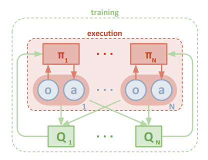
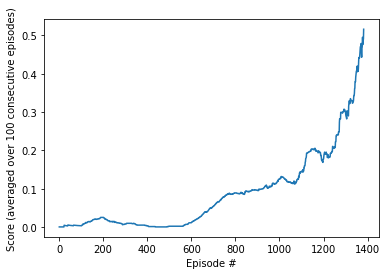

# 1. Introduction
This document describes the training of a two tennis playing agents. The goal of the agents is to keep the ball in the air for as long as possible. Each agent is rewarded individually - if the agent is able to hit the ball over the net it receives a reward of +0.1. If it lets the ball hit the ground or get out of bounds it receives a reward of -0.01. The task is episodic meaning that one game lasts for 1000 timesteps max and is restarted if the ball hits the ground or gets out of bounds.
To control the agents 2 continuous actions are computed for each agent which correspond to the horizontal motion of the agent and jumping. The state space consists for each agent of a total of 24 states (position and velocity of ball and racket stacked for 3 consecutive episodes).

The training task is considered solved when an average score of +0.5 is achieved for 100 consecutive episodes. The reward per episode is calculated by summing the rewards for each agent over one episode This gives two scores per episode. For the calculation of the averaged reward the bigger value is chosen.

The project contains the following files with the following functions:

- Tennis.ipynb: Jupyter Notebook to load the required python modules, perform the training process and display the results
- maddpg__agent.py: contains the classes MADDPGAgent, DDPGAgent, OUNoise and ReplayBuffer. The MADDPGAgent class defines (among others) the functions to select the next actions for both agents and to train the agents by applying the MADDPG algorithm. This is explained in greater detail in the next section of this document. In the DDPGAgent class the functions and networks for each ddpg-agent are defined. This class is instantiated twice from MADDPGAgent (one for each of the two tennis-playing agents). In the OUNoise class the noise process is defined that is used to perturb the output that is computed for each agent in order to properly explore the state space during the training process. In the ReplayBuffer class (state, action, reward, next_state)-tuples are recorded during robot operation and are stored to be used in the training process.
- model.py: here the architecture of the actor and critic neural network(s) that are used for the DDPG algorithm are defined.
- checkpoint_agent1/2_actor/critic.pth: Snapshots of the trained networks for actor and critic for each of the two agents. For inference only the actor networks will be required.

# 2. Learning Algorithm
In this section the Learning Algorithm that is defined in maddpg_agent.py is described in greater detail. MADDPG here stands for "Multi Agent Deep Deterministic Policy Gradient". In the context of this project this means that both tennis playing agents implement the ddpg algorithm in order to learn their mapping from states to actions. The classic DDPG algorithm has already been used for project 2 of this nanodegree. For a description of the algorithm therefore please check the description in the file "Report.md" of the github repository for that project [1].

For the purposes of this project this algorithm is now extended to account for more than one agent:

As can be seen from the figure - which is taken from the original maddpg paper [2] - each agent has its own actor and critic networks. The actor takes as input only the agents own observations "o" to compute the output actions "a". The agent's critic however uses the observations and actions of all agents as input. The observations and actions that are used as input for the actor and critic networks are sampled from a replay pool to break up the correlation between consecutive tuples. The sampling is performed individually for each agent - meaning that at each training step a (state, action, reward,...)-tuple is sampled independently for each agent.

# 3. Network Architecture
The actor network(s) have 24 inputs (the state vector), two hidden layers with 512 weights in the first and 256 in the second hidden layer and 2 (continuous) outputs. Relu's are used as activation functions for the hidden layers in combination with batch normalizazion (prior to the relus) and tanh is used to compute the outputs from the last layer.
The critic network(s) take the state and action vectors of both agents as input for the first layer (=> input size of 52). The first hidden layer has 512 weights, the second hidden layer has 256 weights and the output layer has 1 output. Relu activations in combination with batch normalization are used as activations for the hidden layers of the critic network.

# 4. Training Progress
To train the algorithm a pool of training samples is built that consists of (state, action, reward, next_state, done)-tuples that are recorded during the training process. To avoid correlations between training samples, batches are sampled randomly from this training pool and are provided to the network.
The following hyperparameters are chosen for the training process:

- The replay buffer has a size of 1e6
- One training batch consists of 256 experience tuples
- The discount factor for computing the DQN-expected reward is 0.99
- The parameters of the target network are updated every 4 episodes; the update is performed as a "soft update" where the old network parameters are weighted with 1e-2 and the new parameters are weighted with 0.99.
- The learning rate for actor and critic is set to 1e-3

The training progress can be seen in the following figure:

Ultimately it took 1382 episodes to train the network.

# 5. Ideas for Future Work
To enhance the training process it could be interesting to experiment with different metaparameters (simulations have shown that the training process is especially sensitive to the setting of the learning rate), use prioritized experience replay or try alternative algorithms like PPO.

# 6. References
[1]: https://github.com/markusbrn/DrlNDContinuousControlP2

[2]: Lowe R., Wu Y., et al: Multi-Agent Actor-Critic for Mixed Cooperative-Competitive Environments, 31st Conference on Neural Information Processing Systems (NIPS 2017), Long Beach, CA, USA.
